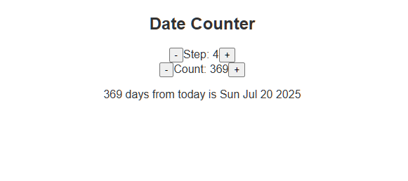

# React State: Step Project

A basic project to understand state in React. Use `useState` hook to handle different state in React. Each time a state changes, React re-renders the whole component with new updated state.

States are component independent. Changing a state into one component doesn't trigger re-render in another component.

<https://github.com/user-attachments/assets/bdda9ff1-1306-4c75-ac71-fe8253b8f64f>

## Date Counter V1

## Date Counter V2
